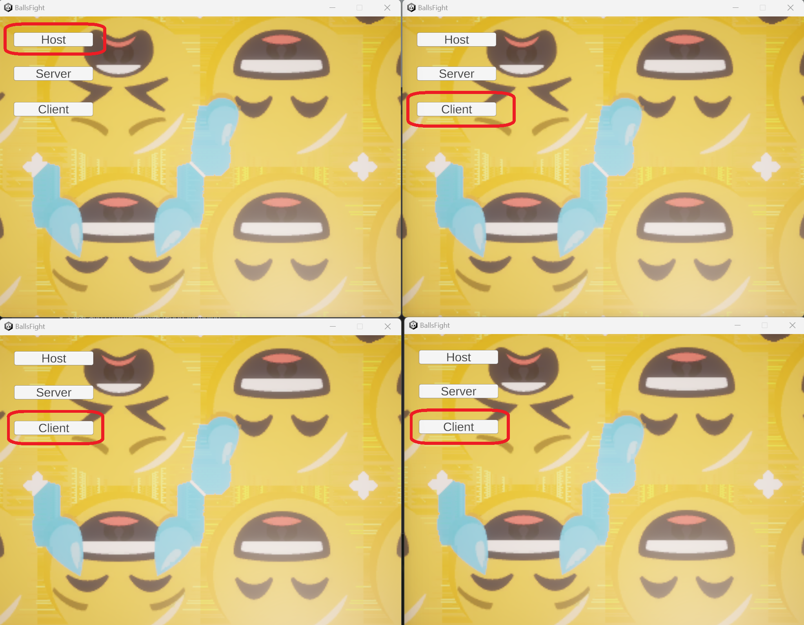
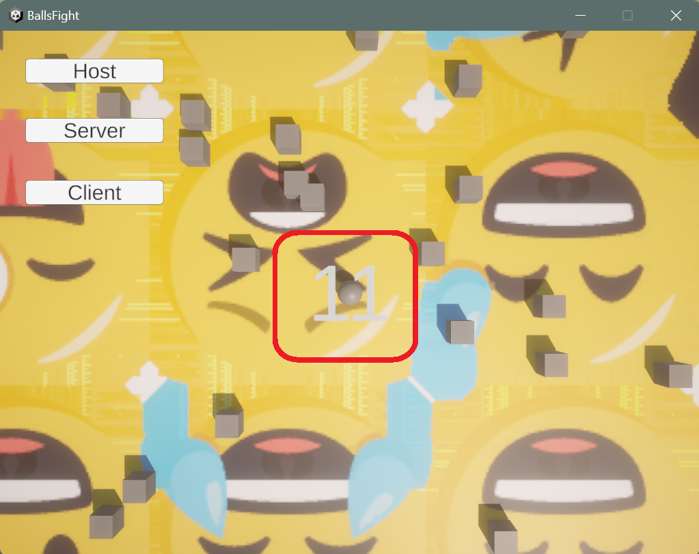
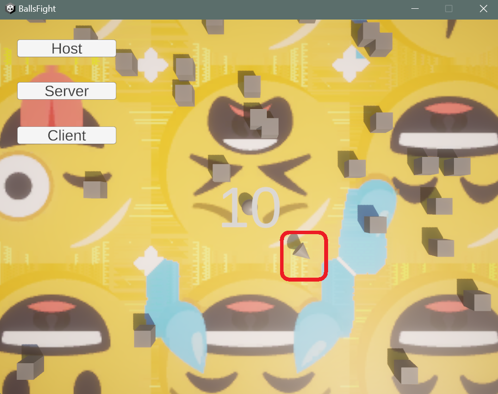
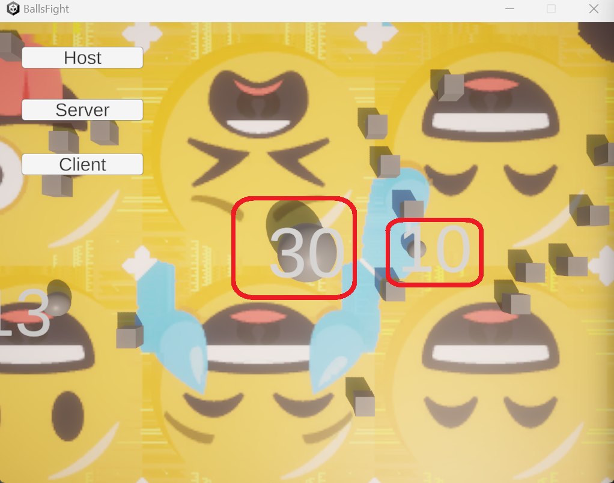
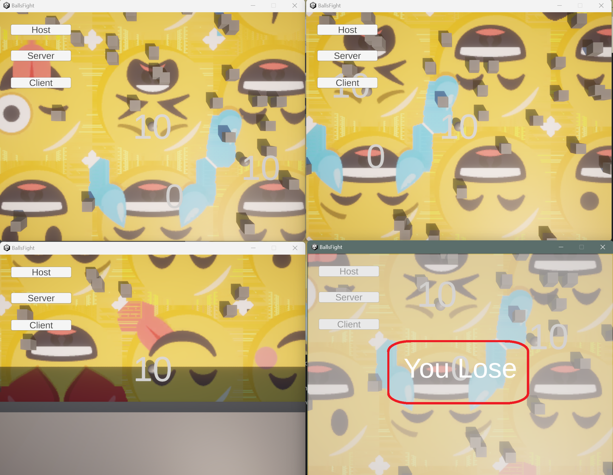
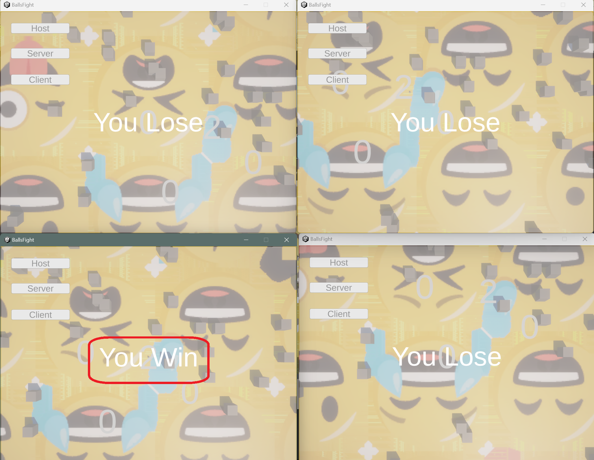
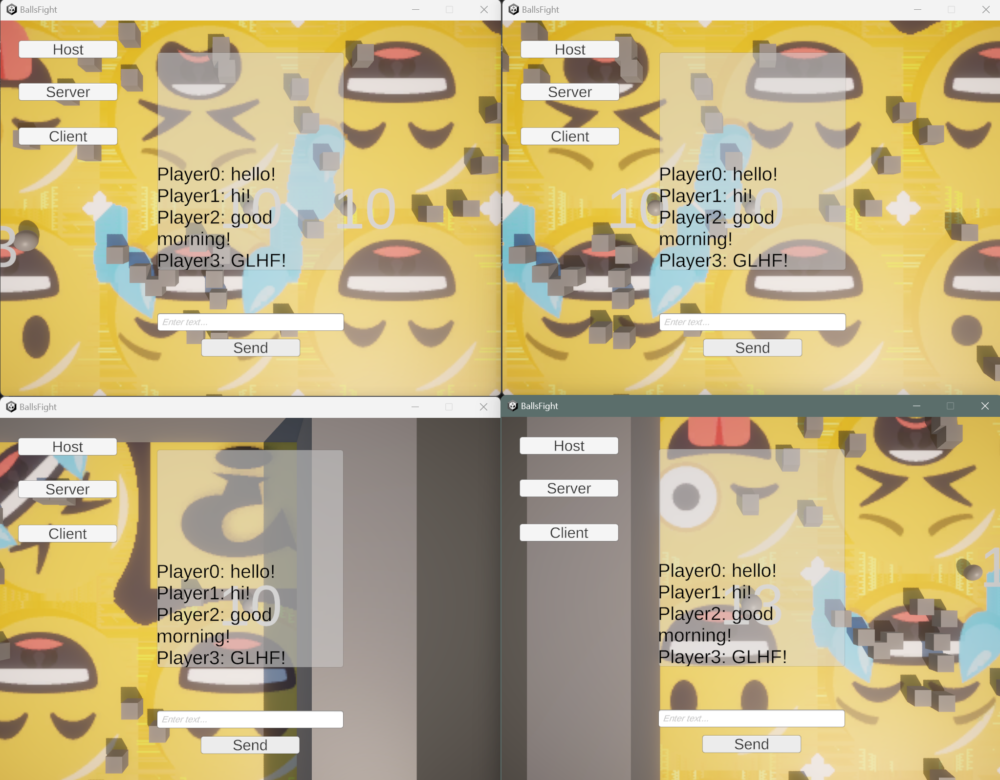
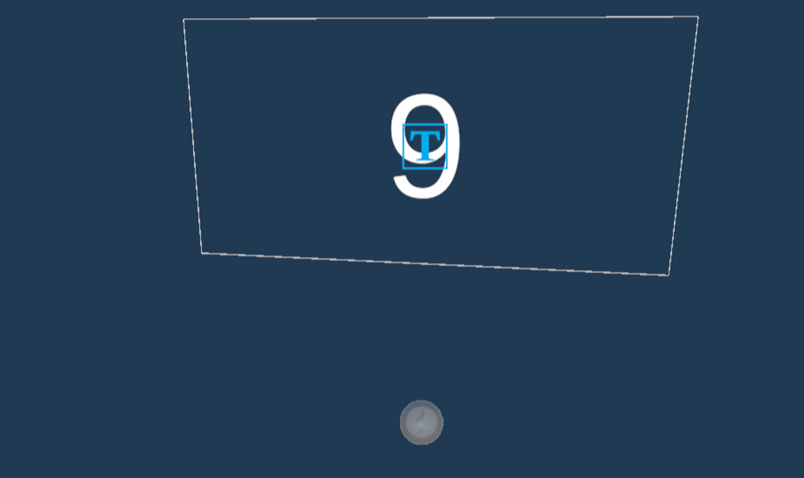
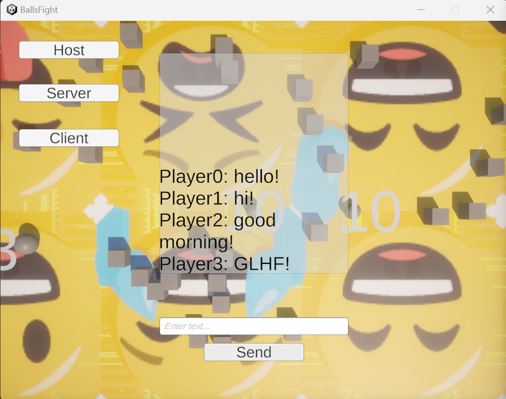

# BallsFight

Balls Fight is a simple Online Multiplayer game based on Unity and its Netcode package.

Before playing, please activate multiple game windows, choose “Host” in one of them, and choose “Client” in the others.

# Gameplay

1. Use “WASD” to move the player (the grey ball)
    
    
    
2. Press the mouse left key to fire, and shoot out a bullet (the grey cone) towards your mouse position.
    
    
    
3. It requires 1 point of energy to fire,  and when hit by a bullet from other players, your energy will be reduced by 2 points.
4. Energy could be recharged by obtaining energy cubes, with 1 point of energy.
5. The more energy you have, the bigger you are.
    
    
    
6. If you lose all your energy (0 energy), you lose and can’t move anymore.
    
    
    
7. If you are the last survivor, you win.
    
    
    
8. In-game you could press “enter” to type and chat with other players, where movement and fire action are disabled.
    
    
    

# Important Network Objects (Prefabs)

## 1. Player

The player consists of a sphere with a rigid body so that you can apply velocity with input, and an in-world canvas to show energy amount.

For the sphere, script “Client Network Transform” from Unity synchronizes the transform. 

Energy is a network variable that can only be modified by the server.

There are functions for the server to modify energy. They are server-only.

When the server does all the calculations to change the energy (either you obtain energy cubes, fire, or are hit by a bullet) of players in the scene, the client will do nothing but only change the size of the sphere.

## 2. Energy Cube

Energy cube is a pooled network object, spawned by “Energy Cube Spawner” in “Pooled Object Manager” in the scene.

When network spawned, there will be 30 energy cubes spawn at thist moment. 

In “Energy Cube Spawner”

Then every 2 second, 1 more energy cube will be spawned if there are less then 50 (max active energe cube amount) energy cubes in the scene.

In “Energy Cube Spawner”

They are spawned and despawned by the server. When collied with the players, help them recharge energy.

In “Energe Cube”

## 3. Bullet

The Bullet is also a pooled network object, spawned (when players fire) and despawned (when collied with other players or walls) by the server.

In “Player Controller”, “Fire” will call “SpawnBulletServerRpc”

In “Player Controller”, “SpawnBulletServerRpc”

In “Bullet Manager”, “SpawnBulletServerRpc”

In “Bullet”, despawn when collied with other player or walls

# Chat

Players can send message to the chat area by texting in the input field and press “Send”.

Chat panel in game

When pressing “Send” button,  “SendText” Function in “ChatPanel” is called.

“SendText” Function in “ChatPanel”

It will send the text message to the server through “AddTextServerRpc”. 

“AddTextServerRpc” in “ChatPanel”

And then server will call “AddTextClientRpc” to populate this text message on every client chat area.

“AddTextClientRpc” in “ChatPanel”

# Win & Lose

Once a player’s energy is reduce to 0 (when “ReduceEnergy” or “ReduceEnergyServerRpc” is called in “PlayerControl”), 2 things will happen.

2 lines in “ReduceEnergy” or “ReduceEnergyServerRpc”, in “PlayerControl”

First is to let server only show lose panel to this client.

In “GameManager”

Second is to check if currently only one player is still active. If so, let server show winning panel to that client.

Check if there is winner, in “GameManager”

Show winner the win panel, in “GameManager”